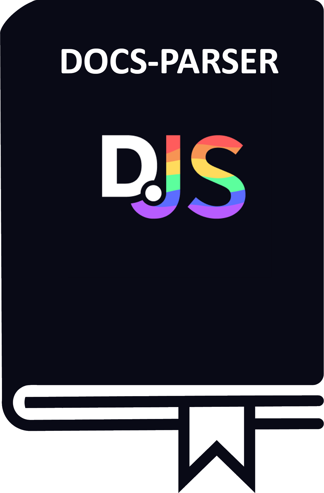

<div align="center">



# discordjs-docs-parser

**Documentation parser for DiscordJS projects. Read documentation JSON from GitHub and outputs easily readable format
for displaying in your environment of choice**

**Note: This is a derivative work based on https://github.com/TeeSeal/discord.js-docs. Many thanks go out to TeeSeal for
the original work.**

[](https://github.com/favna/discordjs-docs-parser/blob/main/LICENSE.md)
[](https://codecov.io/gh/favna/discordjs-docs-parser)
[](https://www.npmjs.com/package/discordjs-docs-parser)

</div>

## About

discordjs-docs-parser is a parser for DiscordJS documentation. It parses the JSON and outputs all the data in a readable
Class format for consumptions. A use case for this library is providing a doc search command in your Discord bot
project. It is also a good way to get a quick overview of the documentation. The prime motivators for this library are
the [Discord Utils Bot](https://github.com/discordjs/discord-utils-bot) and
[Sapphire Application Commands](https://github.com/sapphiredev/sapphire-application-commands) projects.

## Installation

Install with your package manager of choice:

```bash
npm install discordjs-docs-parser
yarn add discordjs-docs-parser
```

## Usage

| [Click here to go to full documentation](https://discordjs-docs-parser.vercel.app/docs/Documentation) |
| ----------------------------------------------------------------------------------------------------- |

### Migrating from [TeeSeal's library][teeseals-library]

**discordjs-docs-parser is written to be a drop-in replacement for TeeSeal's library**. This means that you can simply
replace the `require`/`import` and most of your code should continue to work exactly as it is written right now. That
said, there are a few things that should be noted that are gone:

1. The `doc.resolveEmbed(query)` method is gone. This is a design choice because I am of the opinion that this library
   should not be doing any opinionated markdown formatting or embed structuring. Instead, it should be left up to the
   consumer to do this.

1. All the `formatted*` methods are gone, _except_ for `formattedName` and `formattedDescription`. Similar to the point
   above, this is because this library should not make any assumptions about how the documentation should be formatted.
   Instead, the consumer should be responsible for formatting the documentation.

### Fetching the documentation

The first step is to fetch the documentation. This is done by calling the `fetch` method. After fetching the
documentation, this library stores the result in an in-memory cache (using a `Map`) for later use.

Please refer to [Doc#fetch](https://discordjs-docs-parser.vercel.app/docs/Documentation/classes/Doc#fetch) examples and
more information.

### Getting a specific doc element by its name

After fetching the documentation from GitHub, and having it stored in the internal cache, you can get a specific element
either by its exact ID or a nested property path.

Please refer to [Doc#get](https://discordjs-docs-parser.vercel.app/docs/Documentation/classes/Doc#get) examples and more
information.

### Using a Fuzzy search to find a document element

If instead of getting the absolute path of a specific element you instead want to perform a fuzzy search for elements
you can use `doc.search`. This will return the top 10 results for the provided query using the [Jaro Winkler Distance
algorithm][jarowinklerdistance].

Please refer to [Doc#search](https://discordjs-docs-parser.vercel.app/docs/Documentation/classes/Doc#search) examples
and more information.

## Buy me some doughnuts

My projects are and always will be open source, even if I don't get donations. That being said, I know there are amazing
people who may still want to donate just to show their appreciation. Thank you very much in advance!

I accept donations through Ko-fi, Paypal, Patreon, GitHub Sponsorships, and various cryptocurrencies. You can use the
buttons below to donate through your method of choice.

|   Donate With   |                      Address                      |
| :-------------: | :-----------------------------------------------: |
|      Ko-fi      |  [Click Here](https://donate.favware.tech/kofi)   |
|     Patreon     | [Click Here](https://donate.favware.tech/patreon) |
|     PayPal      | [Click Here](https://donate.favware.tech/paypal)  |
| GitHub Sponsors |  [Click Here](https://github.com/sponsors/Favna)  |
|     Bitcoin     |       `1E643TNif2MTh75rugepmXuq35Tck4TnE5`        |
|    Ethereum     |   `0xF653F666903cd8739030D2721bF01095896F5D6E`    |
|    LiteCoin     |       `LZHvBkaJqKJRa8N7Dyu41Jd1PDBAofCik6`        |

## Contributors ✨

Thanks goes to these wonderful people ([emoji key](https://allcontributors.org/docs/en/emoji-key)):

<!-- ALL-CONTRIBUTORS-LIST:START - Do not remove or modify this section -->
<!-- prettier-ignore-start -->
<!-- markdownlint-disable -->
<table>
  <tr>
    <td align="center"><a href="https://favware.tech/"><br /><sub><b>Jeroen Claassens</b></sub></a><br /><a href="https://github.com/favna/discordjs-docs-parser/commits?author=favna" title="Code">💻</a> <a href="#ideas-favna" title="Ideas, Planning, & Feedback">🤔</a> <a href="#projectManagement-favna" title="Project Management">📆</a> <a href="#question-favna" title="Answering Questions">💬</a> <a href="https://github.com/favna/discordjs-docs-parser/pulls?q=is%3Apr+reviewed-by%3Afavna" title="Reviewed Pull Requests">👀</a> <a href="#userTesting-favna" title="User Testing">📓</a> <a href="#maintenance-favna" title="Maintenance">🚧</a> <a href="https://github.com/favna/discordjs-docs-parser/commits?author=favna" title="Documentation">📖</a></td>
    <td align="center"><a href="https://github.com/apps/renovate"><br /><sub><b>renovate[bot]</b></sub></a><br /><a href="#maintenance-renovate[bot]" title="Maintenance">🚧</a></td>
  </tr>
</table>

<!-- markdownlint-restore -->
<!-- prettier-ignore-end -->

<!-- ALL-CONTRIBUTORS-LIST:END -->

This project follows the [all-contributors](https://github.com/all-contributors/all-contributors) specification.
Contributions of any kind welcome!

[teeseals-library]: https://github.com/TeeSeal/discord.js-docs
[jarowinklerdistance]: https://en.wikipedia.org/wiki/Jaro–Winkler_distance
